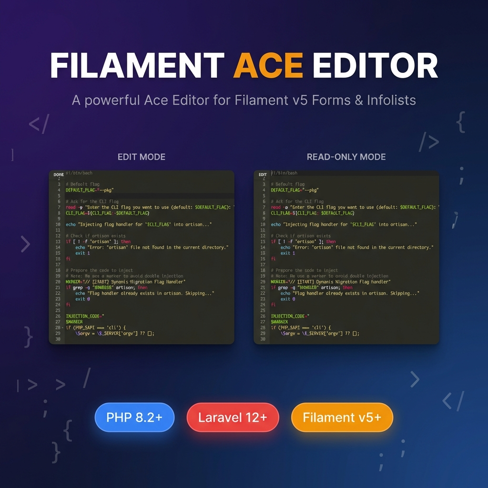

# Filament Ace Editor (Supporting Filament v5)

[](https://packagist.org/packages/iperamuna/filament-ace-editor)
[](https://packagist.org/packages/iperamuna/filament-ace-editor)
[](https://packagist.org/packages/iperamuna/filament-ace-editor)

A powerful Ace Editor implementation for Filament v5 Forms and Infolists with syntax highlighting, themes, autocompletion, and read-only mode support.

## Requirements

- PHP 8.2+
- Laravel 12.x
- Filament 5.x

## Installation

You can install the package via composer:

```bash
composer require iperamuna/filament-ace-editor
```

The package will automatically detect your Filament version and work seamlessly with your installation.

## Usage

### Basic Form Field

```php
use Iperamuna\FilamentAceEditor\AceEditor;

AceEditor::make('content')
    ->label('Code Editor')
    ->mode('php')
    ->theme('monokai')
    ->minLines(20)
    ->maxLines(50);
```

### Advanced Configuration

```php
AceEditor::make('script_content')
    ->label('Shell Script')
    ->hint(fn ($state) => new HtmlString(
        view('components.copy-button', ['content' => $state])->render()
    ))
    ->mode('sh')
    ->theme('monokai')
    ->minLines(20)
    ->maxLines(30)
    // Toggleable edit/read-only mode
    ->toggleable(true)
    // Control initial read-only state
    ->defaultReadOnly(fn ($livewire) => $livewire->getRecord() !== null)
    // Add extensions
    ->addExtension('searchbox')
    // Custom editor options
    ->options([
        'tabSize' => 2,
        'showPrintMargin' => false,
        'enableBasicAutocompletion' => true,
    ]);
```

### Infolist Entry

```php
use Iperamuna\FilamentAceEditor\AceEditorEntry;

AceEditorEntry::make('content')
    ->label('Script Content')
    ->mode('sh')
    ->theme('monokai')
    ->minLines(15)
    ->maxLines(50);
```

## Key Features

### 🔒 Read-Only Mode Control

The `defaultReadOnly()` method helps prevent unwanted edits, especially useful when editing existing records. You can control it with a boolean or closure:

```php
// Always read-only initially
AceEditor::make('config')
    ->defaultReadOnly(true);

// Read-only when editing existing records, editable when creating new ones
AceEditor::make('script_content')
    ->defaultReadOnly(fn ($livewire) => $livewire->getRecord() !== null);

// Custom logic based on user permissions
AceEditor::make('sensitive_data')
    ->defaultReadOnly(fn ($livewire) => !auth()->user()->can('edit', $livewire->getRecord()));

// Disable read-only mode entirely
AceEditor::make('content')
    ->defaultReadOnly(false);
```

**Example Use Case**: When a form is in create mode, the editor automatically opens in edit mode. When viewing or editing an existing record, it starts in read-only mode to prevent accidental changes. Users can toggle to edit mode when needed.

### 🎨 Theme Support

```php
// Light theme for day work
AceEditor::make('content')
    ->theme('github');

// Dark theme for night owls
AceEditor::make('content')
    ->theme('monokai');
```

Available themes include: `monokai`, `github`, `tomorrow`, `twilight`, `solarized_light`, `solarized_dark`, and many more.

### 🔧 Toggleable Edit Mode

Allow users to switch between read-only and edit modes:

```php
AceEditor::make('content')
    ->toggleable(true)  // Shows EDIT/DONE toggle button
    ->defaultReadOnly(true);  // Starts in read-only mode
```

### 📏 Flexible Sizing

```php
AceEditor::make('content')
    ->minLines(10)   // Minimum editor height
    ->maxLines(50);  // Maximum editor height
```

### 🧩 Extensions Support

```php
AceEditor::make('content')
    ->addExtension('searchbox')
    ->addExtension('beautify')
    ->addExtension('language_tools');
```

## Configuration

Publish the configuration file to customize defaults:

```bash
php artisan vendor:publish --tag="filament-ace-editor-config"
```

This creates `config/filament-ace-editor.php`:

```php
return [
    'base_url' => 'https://cdnjs.cloudflare.com/ajax/libs/ace/1.32.7',
    
    'editor_options' => [
        'enableBasicAutocompletion' => true,
        'enableLiveAutocompletion' => true,
        'enableSnippets' => true,
        'showPrintMargin' => true,
        'highlightActiveLine' => true,
        'displayIndentGuides' => true,
    ],
    
    'enabled_extensions' => [
        'language_tools',
        'beautify',
        'searchbox',
    ],
];
```

### Available Methods

| Method | Description | Default |
|--------|-------------|---------|
| `mode(string)` | Set syntax highlighting mode | `'sh'` |
| `theme(string)` | Set editor theme | `'monokai'` |
| `minLines(int)` | Set minimum editor height | `15` |
| `maxLines(int)` | Set maximum editor height | `50` |
| `toggleable(bool)` | Enable edit/read-only toggle | `true` |
| `defaultReadOnly(bool\|Closure)` | Set initial read-only state | `true` |
| `addExtension(string)` | Add Ace extension | `[]` |
| `options(array)` | Override editor options | `[]` |

## Supported Languages

Ace Editor supports over 110 programming languages and markup formats. Common modes include:

**Programming Languages:**
- `php`, `python`, `javascript`, `typescript`, `java`, `c_cpp`, `ruby`, `go`, `rust`

**Web Technologies:**
- `html`, `css`, `scss`, `less`, `json`, `xml`, `yaml`

**Data & Config:**
- `sql`, `mysql`, `pgsql`, `ini`, `toml`, `dockerfile`

**Scripting:**
- `sh` (Shell/Bash), `powershell`, `batchfile`

**Markup:**
- `markdown`, `latex`, `asciidoc`

See the [Ace Editor documentation](https://ace.c9.io/) for the complete list of supported modes.

## Publishing

Publish the views for customization:

```bash
php artisan vendor:publish --tag="filament-ace-editor-views"
```

Publish the configuration:

```bash
php artisan vendor:publish --tag="filament-ace-editor-config"
```

## Supported Features

This package supports most powerful features from [Ace Editor](https://ace.c9.io/#features):

- ✅ Syntax highlighting for 110+ languages
- ✅ Multiple themes (light and dark)
- ✅ Code autocompletion
- ✅ Search and replace
- ✅ Code folding
- ✅ Multiple cursors
- ✅ Line numbering
- ✅ Automatic indentation
- ✅ Read-only mode with toggle
- ✅ Customizable key bindings
- ✅ Extensions support

## Changelog

Please see [CHANGELOG](CHANGELOG.md) for more information on what has changed recently.

## Credits

- [Indunil Peramuna](https://iperamuna.online)
- [All Contributors](../../contributors)

## License

The MIT License (MIT). Please see [License File](LICENSE) for more information.
